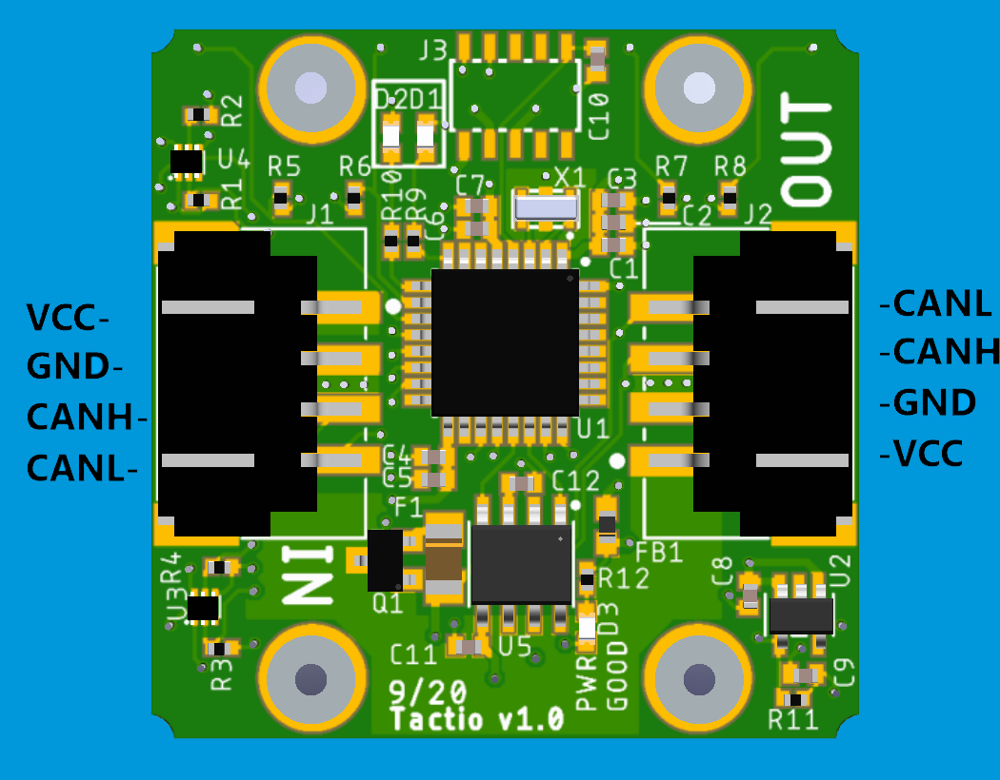

# Walkthrough Documentation

Connecting a Tactio node to a PC requires an intermediary device to bridge the Tactio CAN bus network to a common PC interface like USB, which we call the "network controller". This walkthrough will show how to assemble such a system on a breadboard with an mbed LPC1768 as an intermediary along with a CAN bus transceiver.


## Required materials:
1. 1x Tactio node
2. 1x [MCP2551 CAN transceiver breakout board](http://www.mdfly.com/products/mcp2551-can-hi-spd-transceiver-breakout-board.html)
3. 1x [mbed LPC1768](https://os.mbed.com/platforms/mbed-LPC1768/)
4. 1x USB A to USB Mini-B cable
5. 1x breadboard
6. jumper wires
7. 2x 120 ohm resistor

Note: We are only connecting 1 Tactio node for now, so we will power the system with our PC from the USB connection. However, if more nodes are being connected at the same time, a separate 5V power supply might be required. If this is the case, ensure the power supply and the mbed share a common ground.

## Wiring

With the LPC1768 and the MCP2551 CAN transceiver on the breadboard, connect the devices together according to the following table:

|  LPC1768   | MCP2551 |
|------------|---------|
| 5V USB Out (VU) |   VCC   |
|    GND     (GND)|   GND   |
|   CAN TD   (p30)|   CTX   |
|   CAN RD   (p29)|   CRX   |

Next, we need to connect the Tactio node to the system with the pinout below. The CANH line on the node is connected to the CANH line on the transceiver; the CANL is connected likewise. GND for the node is connected to the system's ground line. Finally, the VCC connection of the breakout is connected to the main input power line, be it the 5V USB out from the LPC, or an external 5V power supply. Be careful that the node is only supplied with 5V. Much higher voltage level will damage it and with less it will not function correctly.

Add the terminating resistors across CANH and CANL on both the breadboard and on the final node in the chain to ensure proper functioning of the CAN Bus network. 



For any additional information on wiring or electrical design, the schematics for both the Tactio node and network controller setup used can be found in the `schematics` folder.

## Network Controller Firmware 

In order for the Network Controller to function, it requires custom firmware. The mbed LPC1768 was the target device, with the firmware binary available in the tagged releases.

## Software 

In order to visualize the sensor information, the [Tactio visualization software](https://github.com/Touche-Design/tactio-software) can be utilized. In order to use the visualization software, make sure to check a couple of things:
1. Screen layout of the sensor nodes need to be configured. Take a look at the `configs` folder to describe the desired geometery for the present node addresses in the system.
2. Set your Network Controller to the necessary target under your Serial port devices. This needs to be performed while the network controller is plugged in.
3. Run the following command in the visualization folder:
```bash
python3 MultiSensorVis.py
```
To incorporate Tactio into your own project, you can utilize the PyTactio library to handle the communications. The communications protocol is documented in the [USB Serial Protocol](USB Serial Protocol.md) file.
